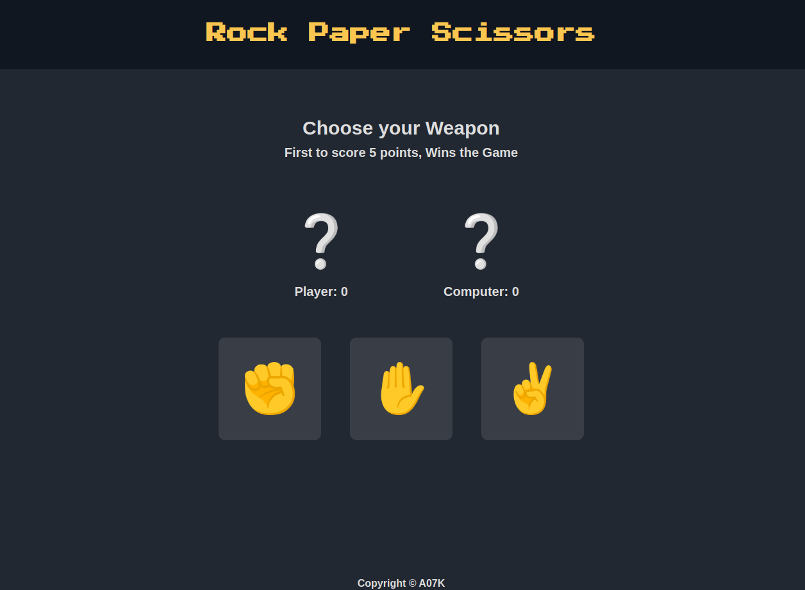

# <a href="https://a07k.github.io/Project-Rock-Paper-Scissors/">Rock Paper Scissors Game</a>

<h2>Description</h2>

This is a simple implementation of the classic Rock Paper Scissors game using HTML, CSS, and JavaScript. Play against the computer and see who reaches 5 points first!

<h2>Features</h2>

<ul>
  <li>Player vs Computer gameplay</li>
  <li>Real-time score tracking</li>
  <li>Visual representation of choices using emojis</li>
  <li>Game explanations for each round</li>
  <li>First to 5 points wins the game</li>
  <li>End game modal with restart option</li>
</ul>

<h2>Technologies Used</h2>

<ul>
  <li>HTML</li>
  <li>CSS</li>
  <li>JavaScript</li>
</ul>

<h2>How to Play</h2>

<ol>
  <li>Click on your choice of rock, paper, or scissors</li>
  <li>The computer will randomly select its choice</li>
  <li>The winner of the round is determined and scores are updated</li>
  <li>The game continues until either the player or the computer reaches 5 points</li>
  <li>When the game ends, a modal appears announcing the winner</li>
  <li>Click the restart button to play again</li>
</ol>

<h2>Setup and Installation</h2>

<ol>
  <li>Clone the repository:
    <pre><code>git clone https://github.com/your-username/rock-paper-scissors.git</code></pre>
  </li>
  <li>Navigate to the project directory:
    <pre><code>cd rock-paper-scissors</code></pre>
  </li>
  <li>Open the index.html file in your web browser to start playing</li>
</ol>
